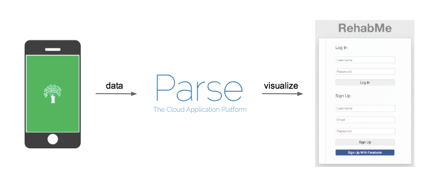
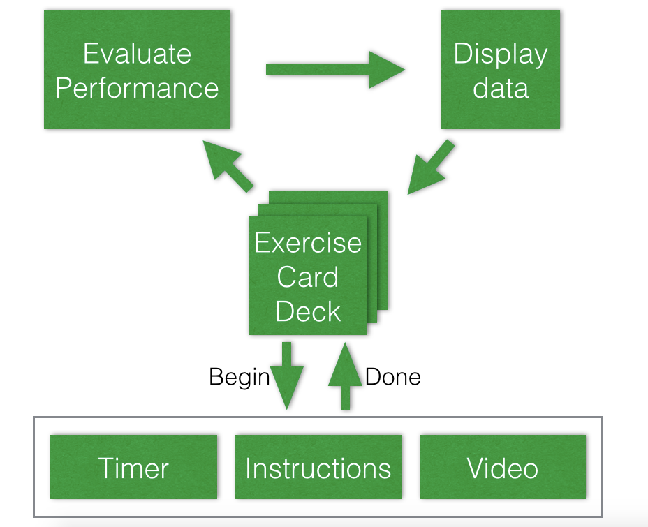
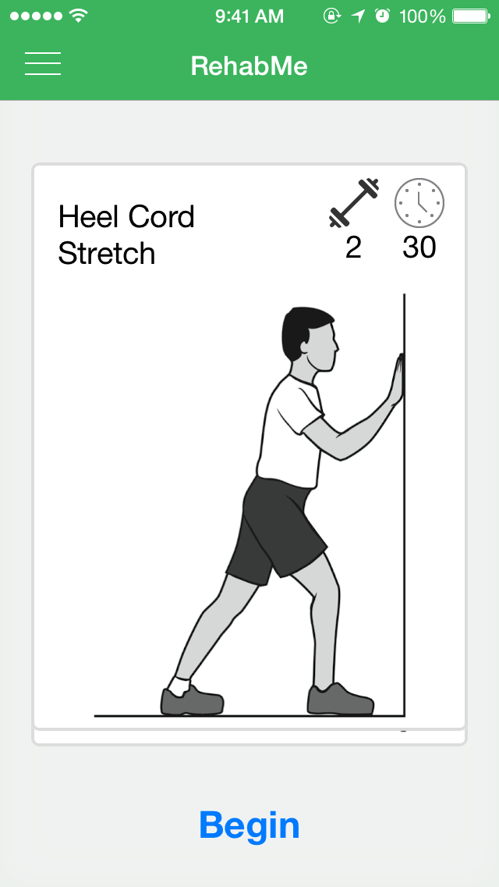
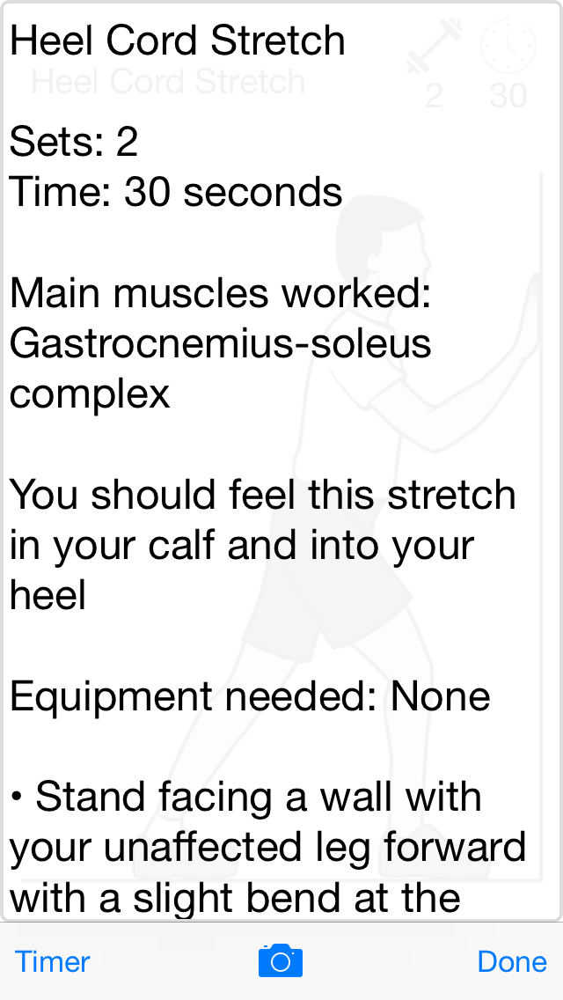
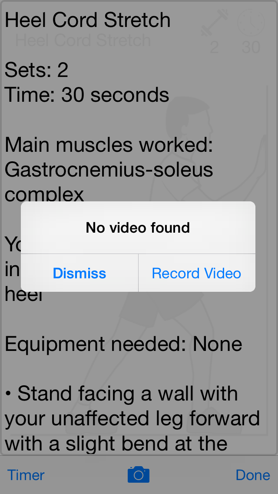
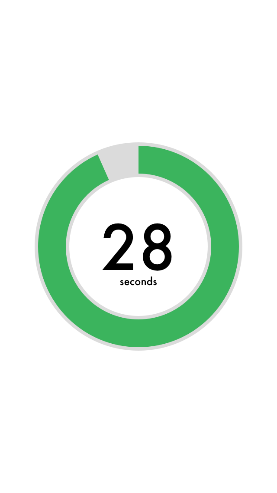

#RehabMe

Rehabilitation therapists estimate that 75% of the patients are not performing rehab exercises at home. Because most patients only go to rehab institutions once a week, or less frequently, in-home rehab exercises are critical for their recovery. Unfortunately from therapists’ estimation tells us a lot more could be done to improve in-home rehab activities, and to help patients better recover.

RehabMe is designed to motivate patients to do their in-home rehab exercises by using multiple motivation schemes such as digital badges and reminders, and connect patients and therapists remotely so that therapists know how their patients are performing at home.

###User Flow
The mobile application itself is self-contained, meaning that the smartphone is the only requirement to operate our app. Selected usage data is sent to Parse, our cloud platform, and  queries data from the cloud platform and visualize the data. 

--- 

#RehabMe Mobile

Each block represents one interface, or view controller, that users will see and perform operations on. Details of the diagram are explained below, with additional figures.

###Login


The first time entrance to the app requires the user to either register or log in to use the app. We also provide a Facebook login so that users can create an account using their Facebook login information.

---

##Usage

1. The app begins with the exercise card deck. Here, all of the exercises are represented by cards. Each card contains the name of the exercise, how many times and how long it should be performed, along with a picture illustration of the exercise.
2. There is a button “Begin” under each card. When pressed, the app enters the card detail view controller that displays the detailed instructions of the exercises. There are three buttons on the bottom: a “timer” button, a camera icon button, and a “done” button.

	- When the user is ready for a particular exercise, the user hits the “timer” button, which brings the app to the timer view controller that shows a countdown clock The time duration of the countdown clock depends on the time required for a particular exercise, typically 30 seconds. The user is expected to perform the exercise until the timer hits zero. Tapping the screen brings the user back to the exercise detail view controller.

	- When the user needs to take a video of himself or herself doing the exercise so they will not forget how to perform the exercise, the user can press the camera icon. If there is no video recorded for this exercise, the app will ask for permission to use the phone camera. Afterwards, the user can record the video when he or she is ready. The recorded video will be associated with the exercise. When a video already exists associated with the exercise, the video will start playing immediately.


3. After completing an exercise, the user has two options to proceed to the next card (exercise) by swiping left or right the current card. 

	- Swiping left is to “discard” the current card, which means that this exercise is not performed. 

	- On the other hand, swiping right means that the exercise is completed. 

4. When all exercises are completed, i.e. all the cards are swiped, the app enters the rate performance view, which provides the user with the opportunity to rate the difficulty level of that session's exercises.




