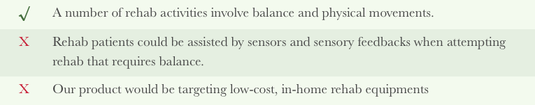
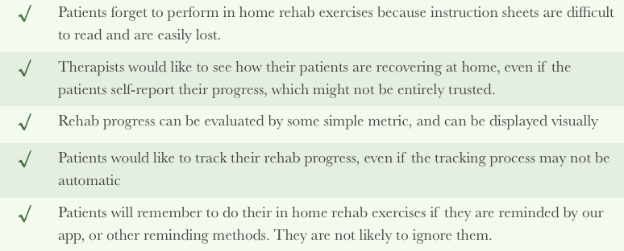
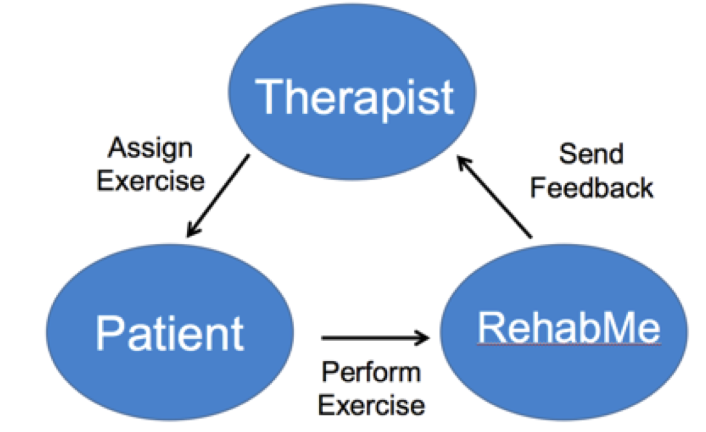
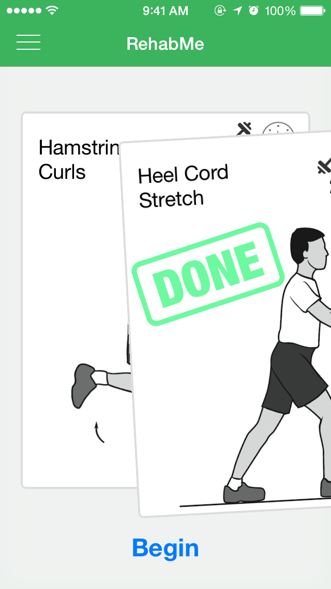
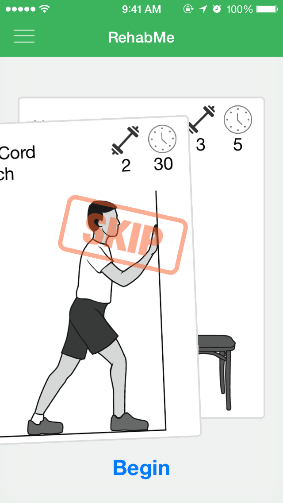
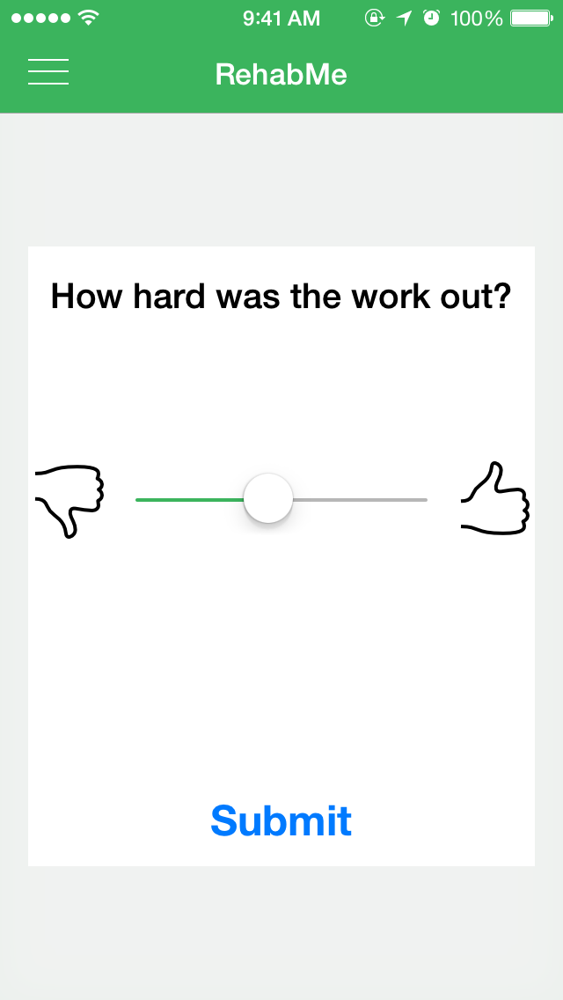
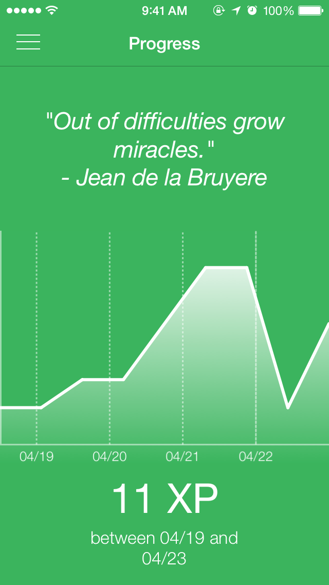
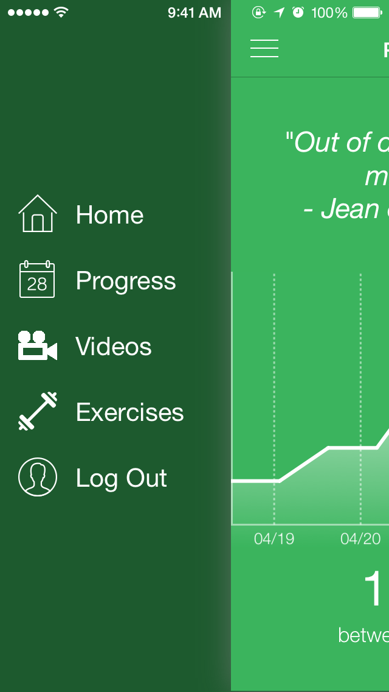

# [Project Deprecated]
I no longer actively maintain this project, but I'm leaving it up for anyone to use in the future. Enjoy!

# RehabMe

Rehabilitation therapists estimate that 75% of the patients are not performing rehab exercises at home. Because most patients only go to rehab institutions once a week, or less frequently, in-home rehab exercises are critical for their recovery. Unfortunately from therapists’ estimation tells us a lot more could be done to improve in-home rehab activities, and to help patients better recover.

RehabMe is designed to motivate patients to do their in-home rehab exercises by using multiple motivation schemes such as digital badges and reminders, and connect patients and therapists remotely so that therapists know how their patients are performing at home.

### Licensing

I am providing all of this code and all of this work unconditionally and free of charge. I am a firm believer in open-source software and hope that this code can help someone in the future.  If you want to use any of my code (although I've moved on from programming in Objective-C) or any of the graphics I've designed, you are free to do so.  All I ask is that you drop me a note and let me know how you are using it (or don't but I enjoy hearing about people's work). Feel free to contact me with any questions you may have through my GitHub account. Enjoy!

### Current State of Physical Rehabilitation
Physical rehabilitation is essential to the recovery of a wide range of injuries and diseases including sports injury, stroke, and parkinson’s disease that affect millions of people every year. There are 1.9 million sports injuries treated in the ER in 2012 alone, and more than 200,000 ACL injuries annually in the US. Physical rehabilitation helps patients with these injuries and diseases to regain physical abilities, such as balance and strength of certain parts of their body. 

During the rehabilitation period, which usually lasts from 4 weeks to 3 months, depending on the injury condition, patients are expected to perform a set of simple daily exercises. Due to insurance constraints, however, most patients only visit rehab facilities once or twice a week  As a result, patients perform most of their rehabilitation exercise at home. Therefore, the quality of in-home exercise separates an excellent recovery from an OK recovery. However, many patients do not perform their in-home rehab exercises. One therapist believes only 15% to 25% of her patients perform the assigned rehab exercises at home. 

We were able to discover several reasons for this phenomenon by interviewing both therapists and patients. Some patients do not understand the importance of in-home exercises and lack motivation to perform them. Some patients find the traditional exercise instruction sheets confusing and intimidating. Currently, therapists have no way to track patients in-home exercises and could end up being blamed for the lack of recovery progress even if they have done everything right.

### Interviews
We conducted more than a dozen interviews with 4 physical therapists, 6 student athletes, and 3 rehabilitation researchers. One of our most important initial hypothesis was that the form of in-home exercises is crucial to patient recovery, and therefore we were considering incorporating motion tracking devices into our project. However, most therapists think that simply getting their patients to think about the exercises is a big step forward and precise form, such as accurate motion tracking, is not nearly as important.

### Hypotheses

#### Phase I

Based on the assumption that we were going to make a product that involved hardware for motion tracking, and software for recording and presenting data, we came up with the following hypothesis, and whether they were validated or rejected through interviews. Green check mark means the hypothesis is validated, and red cross means the hypothesis is rejected. These indications stay the same for the entire section.

What we found is that most of the rehab exercises are relatively simple. Some of them do not require any movement; instead, they require the patients to stretch or hold a position for a duration of time. This means that even though we might use sensors to provide feedback for a few rehab exercises, our product would be limited to only those exercises that require motion, and would not be applicable for other exercises that require less or even no motion. We have also found that because the exercises are simple, patients can perform exercises by assistance of a chair, a table or a wall. More complicated exercises will be performed in the hospital, where advanced equipment will assist them in doing the exercises. Therefore, we believe that there is no need for the patients to purchase additional equipment to assist their in-home rehab exercises, even though this equipment might be of low cost. 

#### Phase II
According to the above findings, we decided to abandon hardware as part of the solution, and switched direction to focus on a software solution. We formed another set of hypotheses, and conducted more interviews to validate them. The hypotheses for the second phase, and whether they were validated or rejected, are listed in the table below. 

This time, we were able to gather some very good results from interviews. The first two validated hypotheses gave us an idea to design an improved version of the instruction sheet that is intuitive, interactive and can be accessed almost everywhere, and at the same time allow therapists to give feedback to the patients when the patients are at home. The other validated hypotheses gave us an idea of some additional useful features that we could include in our solution. All combined, these hypotheses confirmed our idea to design a software solution that can best assist patients’ in-home rehabilitation. We choose iOS as our platform for the software application. More details of our minimum viable product is explained in the next section. 

# Solution

Based on findings from our interviews, we decided to create RehabMe — the interactive in-home rehabilitation solution that helps patients achieve the best possible recovery.

Our primary goal is to, on the one hand, provide interactive exercise instructions for patients to replace traditional exercise sheets, and on the other hand, help therapists track patients’ in-home exercise progress and better evaluate their performance. Our application connects patients with their therapists and there are two parts of our MVP — mobile application and cloud application.

Therapists assign desired exercises through our cloud application. Assigned exercises are then presented as a deck of cards in our mobile application for the patients. Patients can perform assigned exercises in any order they wish. Patients simply swipe left if they wish to skip an exercise or perform it later; or swipe right after completing an exercise. Instead of reading through wordy instructions for a particular exercise, patients can simply watch a video to learn the exercise. The application also provides a built-in timer to assist patients with holding exercises and sends out notices to remind patients to perform their exercises. After finishing their daily work, patients are asked to rate the difficulty of their exercise.

Our cloud application receives all of the exercise data from the mobile application and visualizes it in a color coded scheme. The therapists then receive a weekly report on the performance of their patients, and can therefore make better decisions for the next step of rehabilitation.

--- 

# RehabMe Mobile

Each block represents one interface, or view controller, that users will see and perform operations on. Details of the diagram are explained below, with additional figures.

### User Flow
The mobile application itself is self-contained, meaning that the smartphone is the only requirement to operate our app. Selected usage data is sent to Parse, our cloud platform, and  queries data from the cloud platform and visualize the data.

#### NOTE: Facebook discontinued Parse :(

---

## Usage

1. The first time entrance to the app requires the user to either register or log in to use the app. We also provide a Facebook login so that users can create an account using their Facebook login information.
2. The app begins with the exercise card deck. Here, all of the exercises are represented by cards. Each card contains the name of the exercise, how many times and how long it should be performed, along with a picture illustration of the exercise.
3. There is a button “Begin” under each card. When pressed, the app enters the card detail view controller that displays the detailed instructions of the exercises. There are three buttons on the bottom: a “timer” button, a camera icon button, and a “done” button.

	- When the user is ready for a particular exercise, the user hits the “timer” button, which brings the app to the timer view controller that shows a countdown clock The time duration of the countdown clock depends on the time required for a particular exercise, typically 30 seconds. The user is expected to perform the exercise until the timer hits zero. Tapping the screen brings the user back to the exercise detail view controller.

	- When the user needs to take a video of himself or herself doing the exercise so they will not forget how to perform the exercise, the user can press the camera icon. If there is no video recorded for this exercise, the app will ask for permission to use the phone camera. Afterwards, the user can record the video when he or she is ready. The recorded video will be associated with the exercise. When a video already exists associated with the exercise, the video will start playing immediately.

4. After completing an exercise, the user has two options to proceed to the next card (exercise) by swiping left or right the current card. 

	- Swiping left is to “discard” the current card, which means that this exercise is not performed. 

	- On the other hand, swiping right means that the exercise is completed. 

5. When all exercises are completed, i.e. all the cards are swiped, the app enters the rate performance view, which provides the user with the opportunity to rate the difficulty level of that session's exercises.

6. Finally a progress graph is presented. 

	- The visualization makes use of the number of exercises performed per day to make a chart for the performance for the past 5 days. The score is calculated by the number of exercises performed in total for the past 5 days.

	- A motivational quote is shown on the top of the screen. 

	- It can be clearly seen how the user is performing for the past few days by making use of simple usage data.

---
## NOTE: I no longer host or own rehame.us. I'm leaving the code up as an example for anyone it can help.

# RehabMe Cloud

This part of the product completes the feedback loop by visualizing patients’ performance data on our website, [RehabMe.us](http://www.rehabme.us "Let's Heal Together") 

##### Test Login Details:
Login: test
Password: test

##### RehabMe.us Code
The code for the website is available under my RehabMe_us repo: <https://github.com/djvolz/RehabMe_us>

#### Data
The following data is automatically sent to the server from the mobile app:
 
 - Date and time each exercise is performed, and the duration of the performance
 - Name and the number of the exercise performed or skipped
 - User self-reported difficulty level of each performance 

#### Cloud Sync
The server hosts information for all exercises. Therefore, patients do not need to have all the exercises stored on their phone and can have their exercises synced across multiple devices. We do this so that therapists can select certain exercises from an exercise database and send them to the patients.

#### Flexibility
All of the exercises are stored on the server, and only a selected few exercises will be downloaded to the mobile app. This provides greater flexibility for therapists to personalize exercises for their patients as well as saves storage space on the patients’ phone. 

#### Parse

##### NOTE: Facebook discontinued Parse :(

We choose Parse as our cloud server, because it is robust and secure with a full-featured API. 

#### Visualize
In order to organize the data to provide information that therapists and patients will understand by instinct, we visualize the the above mentioned performance data to show the patient’s performance over time. 

#### Real time
The website is updated in real-time: whenever the user completes an operation, the data shown on the website will be updated instantly. 

---

# Future Work

Human factor is a very important and indispensable component in our application. In the product prototype we have designed so far, we built the framework that effectively addresses the hypothesis we have validated during the customer discovery process. Under the framework, we use a card interface with useful features such as timer and video taking to replace traditional exercise instruction sheet, and website to visualize useful data sent from the app to the server for therapists to remotely understand their patients. In addition to all the features we have built, we would like to enable interaction among people, so that the app is not only much more fun to use, but also provides additional motivation for people to perform their in home rehab exercises. Therefore, we propose the following next steps:

#### Reward System
Giving our users rewards based on certain usage data has been proven to be an effective way to increase app usage.

#### Messaging Services
We will enable even more interactivity between therapists and patients by a messaging system. With instant message functionality, therapists have the ability to send encouraging words, or friendly reminders, to the patients, based on the patients’ performance that the therapists can view on the website. This functionality allows patients to receive feedback from therapists in real time, so that they get a sense of accomplishments when the therapists praise them on good performance, or they work on their exercises when the therapists remind them of not performing exercises for the day. Either way, we believe that the messaging system is a good way to connect therapists and patients, and to help patients better perform their in-home exercises. 

#### Social Network
We will allow users to share their achievements on social networks. It has two benefits: firstly, users get extra motivation for doing their home rehab exercises by sharing their achievements to their friends, and secondly, more people will know about our application and try it themselves. Therefore, social networks not only help users recover better, but also help us attract more users.

#### HealthKit and ResearchKit
The advantage of building the application on iOS device is the possibility to integrate with apple’s HealthKit and ResearchKit. These two kits provide API for medical data, and have various data visualization and research tools. By integrating HealthKit, we open the gate for the user to combine the data from our app with data from other health related applications the user might use to get a thorough landscape of the user’s health and recovery conditions.  Similarly, by integrating ResearchKit, we create opportunities for researchers and doctors to make use of the usage data generated by our application for research purposes. With the advancement of big data analysis, we hope that our app, with the integration of ResearchKit and descent number of users, will allow scientists to discover better rehab methods that may further enhance a patient’s recovery. 

---

# Screenshots

** I know the images are large, but I prefer to just provide the full quality screenshots. **

